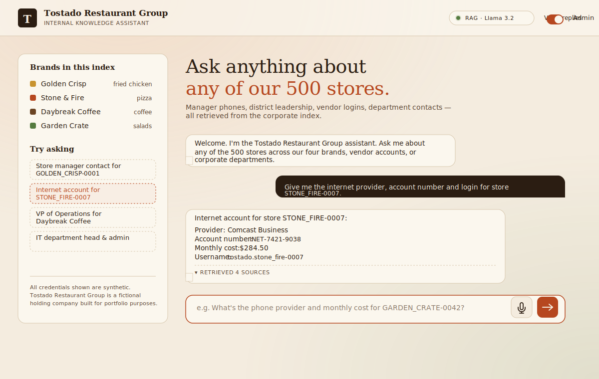

# Tostado Restaurant Group — Internal RAG Assistant

[](https://github.com/etostado1201-Chio/tostado-rag/actions/workflows/ci.yml)
[](LICENSE)
[](https://www.python.org/downloads/)
[](tests/)

<p align="center">
  
</p>

A retrieval-augmented chatbot that answers questions about the operations of
**Tostado Restaurant Group**, a fictional holding company that runs four
fast-food brands:

| Brand           | Category |
|-----------------|----------|
| Golden Crisp    | Fried Chicken |
| Stone & Fire    | Pizza |
| Daybreak Coffee | Coffee |
| Garden Crate    | Salads |

The dataset covers **500 stores**, their store managers, district managers,
VPs of Operations, telecom and internet vendor accounts (with logins), and
seven corporate departments. Each department has a named admin who can sign
into the admin console and update records — the FAISS index is rebuilt
automatically on every change.

This project is released under the MIT License and is intended as a free,
open-source starting point for franchise owners and as a portfolio piece
demonstrating skills from the IBM **Building Generative AI-Powered
Applications with Python** course on Coursera.

> **Heads-up before you replace the badge URL:** the CI badge above points
> to `etostado1201-Chio/tostado-rag`. Change `your-org` to your actual GitHub org or
> username after you push the repo, otherwise the badge will render as
> "unknown".

---

## Architecture

```
┌────────────────────┐     ┌──────────────────────┐     ┌────────────────────┐
│  HTML / CSS / JS   │ →   │  Flask  (backend/)   │ →   │  RAG Engine        │
│  frontend/         │     │  /api/chat           │     │  LangChain + FAISS │
│  index.html        │     │  /api/transcribe     │     │  HuggingFace       │
│  admin.html        │     │  /api/login          │     │  embeddings        │
│  + microphone      │     │  /api/admin/update   │     │  Ollama Llama 3.2  │
│  + voice replies   │     │  /api/admin/reindex  │     │                    │
└────────────────────┘     └──────────────────────┘     └────────────────────┘
                                       ▲                         ▲
                                       │                         │
                              JWT (per-department admin)         │
                                                                 │
                                              ┌──────────────────┴────────┐
                                              │  data/*.json (Faker)      │
                                              │  vector_store/ (FAISS)    │
                                              └───────────────────────────┘
```

| Layer        | Technology |
|--------------|------------|
| LLM          | Ollama running `llama3.2:3b` |
| Embeddings   | HuggingFace `sentence-transformers/all-MiniLM-L6-v2` |
| RAG          | LangChain (LCEL) + FAISS (local) |
| Backend      | Flask + flask-cors |
| Auth         | bcrypt + PyJWT (one admin per department) |
| Frontend     | HTML + CSS + Vanilla JS (no framework) |
| STT (voice)  | HuggingFace `transformers` + `openai/whisper-tiny.en` (server-side, optional) |
| TTS (voice)  | Browser-native `SpeechSynthesis` API (zero install) |
| Synthetic data | Faker — 500 stores |

---

## Key engineering decisions

I'd rather over-explain my choices than under-explain — every one of
these had at least one honest alternative I rejected.

### Why FAISS in-process, not a remote vector DB
1,631 documents, ~80 MB index, single-tenant internal tool. A managed
vector DB (Pinecone, Weaviate) would add network latency and ops
overhead for zero benefit. The whole index rebuilds in under 5 s, which
keeps the "admin patches a record → index reflects it immediately" flow
trivial. **At 10M+ vectors I'd switch to pgvector**; the contract in
`backend/rag_engine.py` is small enough that this is a one-day change.

### Why `all-MiniLM-L6-v2` embeddings
384-dim, 80 MB, fast on CPU, and the workhorse default of the
`sentence-transformers` library. Measured **recall@6 ≥ 90%** on the eval
set (see [`docs/eval_results.md`](docs/eval_results.md)). For a
CRUD-lookup style RAG that's enough to be useful without paying API
fees. Easy upgrades: `bge-base-en-v1.5` for higher English quality, or
`paraphrase-multilingual-MiniLM-L12-v2` for multilingual support.

### Why `llama3.2:3b` instead of GPT-4 / Claude
The franchise-owner persona this is built for has 500 stores, not a
Fortune-500 budget. A 3B model running locally costs $0/query and never
leaks vendor logins to a third-party API. The retrieval pipeline carries
the heavy lifting — the LLM just summarises the retrieved passages, and
a 3B model does that well enough. The architecture is LLM-agnostic:
swap `ChatOllama` for `ChatAnthropic` whenever a customer wants the
quality bump.

### Why rule-based follow-up suggestions, not a second LLM call
The metadata of the retrieved sources already tells me exactly what the
user is likely to ask next (a `store` doc → suggest its vendor accounts;
a `vendor` for `Phone` → suggest the `Internet` account for the same
store). A 3B LLM would invent fuzzier suggestions for the same compute
and latency cost. See [`backend/followups.py`](backend/followups.py).

### Why a `create_app()` factory and a mock RAG engine in tests
Without it, tests would need Ollama running and 80 MB of embedding
weights downloaded — the suite would take minutes, not seconds, and
GitHub Actions would balk. The factory accepts an injected `engine` and
`data_dir`, so tests run **hermetically in 15 s** with a `MagicMock`
engine and a temp-directory dataset.

### Why bcrypt + JWT, not session cookies
Session cookies require server-side state (Redis or similar). JWT keeps
the backend stateless — useful when the natural deployment is a single
Flask container that should restart cleanly. bcrypt over the password
because it's deliberately slow and salted. **Trade-off I'm honest
about**: JWTs can't be revoked individually short of rotating the
secret. For an internal tool with 7 admin accounts, that's acceptable.

### Why brands are a dataset, not constants in code
The original design had brands hardcoded in four files (the data
generator, the RAG regex, the system prompt, the frontend sidebar).
When I checked the actual lifecycle with the persona — restaurant
groups acquire and shutter brands more often than you'd think — that
hardcoding became a real liability. I refactored brands into
`data/brands.json` and made the **system prompt and the store-ID
regex rebuild from that file** on every reindex. Net result: adding
a 5th brand is a single API call, not a code change.

### Why atomic store creation, not "create store then add vendors"
Inviting an admin to create a store and then *remember* to add its
phone and internet accounts is a recipe for orphan records and a
chatbot that says "I don't have vendor accounts for X" minutes after
the store was created. `POST /api/admin/stores` always creates both
vendor accounts as part of the same write, with `provider: "TBD"`
placeholder values. The admin can fill in real provider details later
through the vendors tab. The data stays consistent by construction.

### Why deep-merge instead of `dict.update` for PATCH
Early on, patching `{"login": {"username": "newname"}}` would wipe the
password because `dict.update` doesn't recurse into nested objects.
The fix lives in [`backend/crud.py`](backend/crud.py): a small
`_deep_merge` that recurses into matching dicts. Now nested fields
are patchable without losing siblings, which matches the behaviour
admins actually expect.

### Why soft delete by default, hard delete behind a confirmation
Closed stores still need to be queryable for audit ("how many stores
were active in Q2 2024?") and might reopen after remodeling. So
"delete" by default is `status: closed`, preserving the record. A real
removal is gated behind `?hard=true&confirm=<id>` — the caller has to
spell out the ID exactly. This pattern shows up in production tools
(Stripe, GitHub, AWS) for the same reason: irreversible operations
should require deliberate intent.

---

## Evaluation

Retrieval quality is measured with a hand-curated dataset of 36
paraphrased questions across stores, vendor accounts, and departments
([`scripts/eval_dataset.py`](scripts/eval_dataset.py)).

```bash
python scripts/evaluate_rag.py             # retrieval-only, fast
python scripts/evaluate_rag.py --with-llm  # also times each LLM answer
```

The harness reports the standard retrieval triad:

| Metric | Meaning |
|--------|---------|
| **Recall@k** | Did the correct doc appear in the top-k results? |
| **MRR** | Mean reciprocal rank — `1/rank_of_first_correct`, averaged |
| **Latency p50 / p95** | Per-question retrieval time |

Plus a **per-category breakdown** so I can spot weak spots (e.g.
vendor accounts under-performing vs stores) and a list of misses for
qualitative inspection. The latest run lives in
[`docs/eval_results.md`](docs/eval_results.md).

`evaluate_rag.py` exits non-zero when **recall@6 drops below 0.85**, so
it doubles as a CI gate against retrieval regressions when I change the
embedding model or the prompt.

The deliberate gap I'm honest about: **answer-level quality is not
end-to-end measured yet** — only retrieval is. Adding `ragas`-style
LLM-as-judge scoring is in [Future work](#future-work).

---

## Operational features

This is a portfolio project, not a Fortune-500 deployment, but every
production basic that's cheap to add is in:

- **Structured JSON logs** — every request emits a single-line JSON
  log with `level`, `logger`, `msg`, plus structured fields like
  `username`, `department`, `n_sources`. Configurable via `LOG_LEVEL`.
- **In-process metrics** at [`/api/metrics`](backend/app.py) —
  counters and per-route latency percentiles (`p50`, `p95`, `p99`).
  No Prometheus dependency; stays proportionate to project size.
- **Health probe** at `/api/health` for container orchestrators.
- **`build_or_load_index`** caches the FAISS index to disk so
  restarts are instant after the first build.
- **Graceful degradation**: if `transformers` is missing, the
  `/api/transcribe` endpoint returns 501 with a helpful message
  instead of crashing the app.

Sample `/api/metrics` response after a few requests:

```json
{
  "uptime_seconds": 412.3,
  "counters": {
    "chat.count": 12,
    "login.count": 1,
    "admin.reindex.count": 1
  },
  "latency_ms": {
    "chat":          {"count": 12, "avg_ms": 1820, "p50_ms": 1750, "p95_ms": 2940, "p99_ms": 2940},
    "login":         {"count": 1,  "avg_ms":   24, "p50_ms":   24, "p95_ms":   24, "p99_ms":   24},
    "admin.reindex": {"count": 1,  "avg_ms": 4430, "p50_ms": 4430, "p95_ms": 4430, "p99_ms": 4430}
  }
}
```

---

---

## Prerequisites

1. **Python 3.10+**
2. **Ollama** — install from <https://ollama.com> and pull the model:
   ```bash
   ollama pull llama3.2:3b
   ollama serve   # runs on http://localhost:11434
   ```
3. (Optional) virtualenv

---

## Quick start with Docker (recommended)

If you have Docker, this is the fastest path. One command brings up Ollama
and the Flask backend together:

```bash
git clone https://github.com/etostado1201-Chio/tostado-rag.git
cd tostado-rag
docker compose up --build
```

Then open <http://localhost:5000>.

What happens automatically on the first run:

1. The `ollama` service starts on port `11434` and downloads `llama3.2:3b`
   (~2 GB — only the first time; cached in a named volume afterwards).
2. The `app` service builds the Flask backend image, waits for Ollama,
   runs `scripts/generate_data.py` to seed the synthetic dataset, builds
   the FAISS index, and starts serving on port `5000`.
3. Department admin credentials are printed in the `app` container logs:
   ```bash
   docker compose logs app | grep "->"
   ```

To enable the microphone (server-side speech-to-text via HuggingFace
Whisper, ~75 MB extra):

```bash
docker compose build --build-arg INSTALL_VOICE=true
docker compose up
```

To stop everything:

```bash
docker compose down            # keeps the model and dataset
docker compose down -v         # nukes the model, dataset, and FAISS index
```

The compose file mounts `./data` and `./vector_store` from the host, so
your generated data and admin hashes persist across container restarts
and stay editable from your local filesystem.

---

## Manual setup (without Docker)

```bash
git clone https://github.com/<your-org>/tostado-rag.git
cd tostado-rag

python -m venv .venv
source .venv/bin/activate       # Windows: .venv\Scripts\activate
pip install -r requirements.txt

cp .env.example .env            # adjust if needed

# 1. Generate the synthetic dataset (500 stores, employees, vendors, admins)
python scripts/generate_data.py

# 2. Start the server. The first run builds the FAISS index — takes ~30s.
python -m backend.app
```

Open <http://localhost:5000> for the chat UI and
<http://localhost:5000/admin> for the admin console.

The data generator prints the seven department admin credentials on stdout
the first time it runs. Save them somewhere safe.

### Optional: voice features

To enable the microphone button (server-side speech-to-text via Hugging Face Whisper):

```bash
pip install -r requirements-voice.txt
# system requirement: ffmpeg must be on PATH
```

Voice replies (text-to-speech) use the browser's native `SpeechSynthesis`
API — toggle them on with the "Voice replies" switch in the top bar.
No extra install needed for TTS.

### A note on `data/admins.json`

`data/admins.json` is **gitignored on purpose**. It contains bcrypt hashes
of the departmental admin passwords for your own dataset, so it is not
something you want to publish. When a franchise owner clones this repo
they run `python scripts/generate_data.py` themselves — that creates a
fresh `data/admins.json` for their environment and prints their own
admin credentials on stdout. Each fork therefore has its own private
admin set, and the public repository ships with no real (or even
synthetic) credentials baked in.

---

## What you can ask the chatbot

- *"Who is the store manager of GOLDEN_CRISP-0001 and how do I reach them?"*
- *"Give me the internet provider, account number and login for STONE_FIRE-0007."*
- *"Who is the VP of Operations for Daybreak Coffee?"*
- *"Who runs the IT department and who is its admin contact?"*
- *"What's the monthly phone bill for GARDEN_CRATE-0042?"*

You can ask any of those by **typing or by clicking the microphone**, and
have the answer **read back to you** by toggling "Voice replies" on.

After every reply the chatbot suggests **2–3 follow-up questions**
based on the records it just retrieved (e.g. after asking about a
store, you'll see one-tap chips for that store's vendor accounts and
its district leadership). The suggestion engine is rule-based and
deterministic — see [`backend/followups.py`](backend/followups.py).

---

## Admin console

The admin console at <http://localhost:5000/admin> is full CRUD over five
resources, designed around how a restaurant group actually operates.

### Resource lifecycle, not just CRUD

| Resource | Frequency of change | UX | Lifecycle model |
|---|---|---|---|
| **Stores** | Weekly / monthly (open, close, remodel) | **Hybrid form** — visual fields for the 90% case, advanced JSON for the 10% | Soft-delete (`status: closed`), preserves audit trail and supports reopening |
| **Vendors** | When a contract changes | JSON editor with deep-merge patches | Hard-delete only (no business reason for "closed phone account") |
| **Brands** | A few times a year (acquisitions) | JSON editor | Soft-delete with referential integrity check (can't close a brand with active stores) |
| **Employees** | A few times a month | JSON editor | Hard-delete |
| **Departments** | Rarely | JSON editor | Hard-delete |

### Hybrid form for stores — why and how

Stores are the only resource with daily-use frequency. A pure JSON editor
made every "open new store" or "update phone" feel slower than it should,
so stores get a **two-mode editor**:

- **Visual fields** (default) — clean, validated inputs for the most-used
  fields: brand, status, address, phone, opening date, store manager.
- **Advanced JSON** — any field on the record, including auto-generated
  things like `district_manager` and `vp_operations`.

The two modes share state, so toggling between them never loses input.
For vendors / brands / employees / departments — all lower-frequency —
a single JSON editor with templates is enough, which saved roughly
600 lines of redundant form UI.

### Atomic creation: store → vendors

Creating a store via `POST /api/admin/stores` also creates its **Phone**
and **Internet** vendor accounts in the same operation, with placeholder
values (`provider: "TBD"`, generated logins). This means the chatbot
never has a moment where it can answer "I have store X but no vendor
records for X" — the data stays referentially consistent by construction.

### Soft delete with audit trail

Closing a store doesn't remove it. It sets `status: "closed"` and
`closed_on: "<date>"`. The RAG retrieval **filters closed stores out by
default** but surfaces them when the question asks for them ("show me
closed stores in Texas"). Reopening is a one-line patch.

Hard delete is gated behind `?hard=true&confirm=<record_id>` — the
admin has to spell out the ID twice, exactly. The console also adds a
JS-level "type the ID to confirm" prompt before issuing the request.

### Referential integrity for brands

Brands are stored as a dataset (in `data/brands.json`) rather than
hardcoded in code. This means the system stays consistent without code
changes when leadership acquires a new brand or shutters one — the LLM
system prompt and the store-ID detection regex both rebuild from
`brands.json` on every reindex.

A brand can't be closed while it has active stores — the API returns
`409 Conflict` with a clear message. This is enforced in the CRUD layer,
not the UI, so a curl call gets the same protection.

### Endpoints at a glance

```
GET    /api/admin/<dataset>              List all records
GET    /api/admin/<dataset>/<id>         Get one record
POST   /api/admin/<dataset>              Create (atomic for stores)
PATCH  /api/admin/<dataset>/<id>         Deep-merge update
DELETE /api/admin/<dataset>/<id>         Soft-delete (or hard with ?hard=true&confirm=<id>)
POST   /api/admin/reindex                Rebuild FAISS without changing data
```

All require a valid JWT in `Authorization: Bearer <token>`.

---

---

## How RAG works in this project

1. `scripts/generate_data.py` writes five JSON files into `data/`.
2. `backend/documents.py` turns each record (store, vendor, employee,
   department) into a short, descriptive passage with metadata.
3. `backend/rag_engine.py` embeds those passages with
   `all-MiniLM-L6-v2` and stores them in a local FAISS index.
4. On every chat turn, the top *k* (default 6) passages are retrieved by
   semantic similarity, fed into a strict system prompt, and answered by
   `llama3.2:3b` running locally on Ollama.
5. The chatbot surfaces the retrieved sources alongside its answer so the
   user can verify nothing was hallucinated.

When an admin updates a record through `/admin`, the JSON file is patched
and the FAISS index is rebuilt — the change is visible to the chatbot
immediately.

---

## Tests

The project ships with a [pytest](https://docs.pytest.org) suite of
**97 tests** that runs in under 35 seconds and needs neither Ollama nor
the embedding model — the Flask app is built through a `create_app()`
factory that accepts an injected mock RAG engine and a temporary data
directory, so unit tests stay fast and hermetic.

```bash
pip install -r requirements-dev.txt
pytest
```

What's covered:

| File | Tests | Scope |
|------|------:|-------|
| `tests/test_auth.py`      | 10 | bcrypt password verification, JWT issue / decode / expiry / signature, case-insensitive admin lookup |
| `tests/test_documents.py` | 6  | JSON → LangChain `Document` conversion, metadata, embedded credentials, brand documents |
| `tests/test_api.py`       | 28 | All HTTP endpoints: chat, login, full CRUD (list / get / create / patch / soft-delete / hard-delete), referential integrity, auth required on every admin route |
| `tests/test_crud.py`      | 26 | The CRUD module in isolation: deep-merge patch, atomic store+vendors creation, brand referential integrity, soft vs hard delete, primary-key invariants |
| `tests/test_followups.py` | 12 | Rule-based follow-up engine: store / vendor / department / employee branches, fallback when there are no sources, dedup, length cap, never echoes the prior question |
| `tests/test_frontend.py`  | 9  | Static parse of `index.html` and `chat.js`: there are exactly four onboarding suggestion chips, every chip has a `data-prompt` and a label, the chips cover the four query categories, no deprecated brand names linger, and `chat.js` still wires up the click handler |
| `tests/test_metrics.py`   | 6  | Counters, latency histograms with percentiles, timer context manager, `/api/metrics` snapshot |

The same suite runs on every push and pull request through GitHub Actions
across Python 3.10, 3.11 and 3.12 — see
[`.github/workflows/ci.yml`](.github/workflows/ci.yml). The CI badge at
the top of this README reflects the current status of `main`.

---

## Project layout

```
tostado-rag/
├── .github/workflows/
│   └── ci.yml                 GitHub Actions: pytest on every push
├── backend/
│   ├── __init__.py
│   ├── app.py                 Flask routes (create_app factory)
│   ├── auth.py                bcrypt + JWT
│   ├── crud.py                CRUD operations + referential integrity
│   ├── documents.py           JSON → LangChain Documents
│   ├── followups.py           Rule-based follow-up suggestion engine
│   ├── logging_config.py      Structured JSON logging
│   ├── metrics.py             In-process counters + latency percentiles
│   ├── rag_engine.py          LangChain + FAISS + Ollama pipeline
│   └── voice.py               HuggingFace Whisper (optional)
├── frontend/
│   ├── index.html             Chat UI (with mic + voice-reply toggle)
│   ├── admin.html             Admin console (tabbed CRUD + hybrid form)
│   ├── css/
│   │   ├── style.css          Shared design tokens + chat UI
│   │   └── admin.css          Admin-only widgets (tabs, mode toggle, lists)
│   └── js/
│       ├── chat.js            Chat + MediaRecorder + SpeechSynthesis
│       └── admin.js           Auth, tabs, hybrid form, JSON editors
├── scripts/
│   ├── eval_dataset.py        Hand-curated 36-question eval set
│   ├── evaluate_rag.py        Recall@k / MRR / latency harness
│   └── generate_data.py       Faker generator (500 stores, 4 brands)
├── tests/
│   ├── conftest.py            Shared fixtures (temp data dir, mock engine)
│   ├── test_api.py            Flask integration tests (incl. CRUD)
│   ├── test_auth.py           Auth unit tests
│   ├── test_crud.py           CRUD module unit tests
│   ├── test_documents.py      Document-builder unit tests
│   ├── test_followups.py      Follow-up engine unit tests
│   ├── test_frontend.py       Static HTML/JS asset tests
│   └── test_metrics.py        Metrics module + endpoint tests
├── data/                      *.json (created by the generator, gitignored)
│                              stores · vendors · employees · departments · brands · admins
├── vector_store/              FAISS index (created at first run, gitignored)
├── docs/
│   ├── ARCHITECTURE.md        Design walkthrough + roadmap
│   ├── INTERVIEW_PREP.md      Talking points for tech interviews
│   ├── PORTFOLIO_BULLETS.md   Ready-to-paste CV / LinkedIn bullets
│   ├── eval_results.md        Latest retrieval eval report (auto-generated)
│   └── preview.svg            UI preview shown at the top of this README
├── .dockerignore
├── .env.example
├── .gitignore
├── docker-compose.yml         Ollama + app, one-shot stand-up
├── docker-entrypoint.sh
├── Dockerfile                 multi-stage, INSTALL_VOICE build arg
├── LICENSE                    MIT
├── pytest.ini
├── README.md
├── requirements.txt           base
├── requirements-dev.txt       pytest
└── requirements-voice.txt     optional STT extras (transformers + torch)
```

---

## Security notes

- `data/admins.json` contains bcrypt-hashed passwords; it is gitignored.
- Set a real `JWT_SECRET` in production.
- This is a demo dataset — every credential it contains is synthetic.
- The chatbot is instructed to refuse to invent data and to flag missing
  information explicitly.

---

## Skills demonstrated (IBM Building Generative AI-Powered Applications)

- Core generative-AI concepts: LLMs, embeddings, RAG.
- Building chatbots with LLMs and retrieval-augmented generation.
- Foundational Python frameworks (LangChain).
- Web-based AI applications with Flask plus HTML / CSS / JavaScript.
- Hugging Face models (`all-MiniLM-L6-v2` for embeddings, Whisper for STT).
- Voice interfaces — speech-to-text and text-to-speech integration.

---

## Future work

A truthful list of what I'd do next, grouped by why I'd do it. Including
this on purpose because knowing what *isn't* there is half of taste.

### Quality
- **Answer-level evaluation**, not just retrieval. Use `ragas` or an
  LLM-as-judge against expected answers to catch the case where the
  retrieval is right but the LLM still hallucinates.
- **Re-ranking** with `bge-reranker-base` between FAISS top-20 and the
  final top-6. Cheap precision boost on noisy queries.
- **Better chunking** — right now each record is one passage. Long
  description fields could benefit from sliding-window chunks once
  records grow.

### Performance & UX
- **Streaming responses** with Server-Sent Events. The current
  full-buffer pattern feels slow even when generation isn't.
- **LRU cache** on `(question_embedding, top-6-doc-ids)` so repeated
  questions skip the LLM entirely.
- **Persistent FAISS index across processes** with memory-mapped files
  so multiple workers can share it.

### Scale
- **Postgres + pgvector** instead of JSON files. Switch the data
  loader to a CDC stream so re-embedding is incremental.
- **Hosted LLM serving** (vLLM behind a load-balancer, or a managed
  API) so the Flask app can scale horizontally without each replica
  needing its own GPU.
- **Per-tenant isolation** — currently all admins share one
  namespace; for multiple franchise groups you'd want OIDC + tenant
  scoping on every query.

### Security
- **Per-department write scopes** (Procurement can patch vendors
  but not employees, etc.) — currently any logged-in admin can update
  any dataset.
- **Append-only audit log** of every admin update, stored separately
  from the data files.
- **JWT revocation** via a short TTL + a refresh-token flow, instead
  of the current 8-hour one-shot tokens.
- **Secret-handling hardening** — the LLM is told to gate credentials
  behind explicit user requests, but I'd add a content filter on the
  output as belt-and-braces.

### Observability
- **Real Prometheus exporter** wrapping the existing metrics module.
- **Distributed tracing** (OpenTelemetry) once there's more than one
  service to trace.
- **Per-tenant rate limiting** at the Flask layer, not just the model.

### Voice
- **Server-side TTS** with HuggingFace `microsoft/speecht5_tts` or
  `facebook/mms-tts-eng` for kiosk / call-centre deployments where
  the client browser can't speak.
- **Multilingual mode** — drop the `.en` suffix on Whisper and add
  language detection so Spanish-speaking franchise owners can use the
  same UI in their language.

---

---

## License

MIT — see [`LICENSE`](LICENSE). Free for franchise owners, students, and
the open-source community to fork, adapt, and run.
